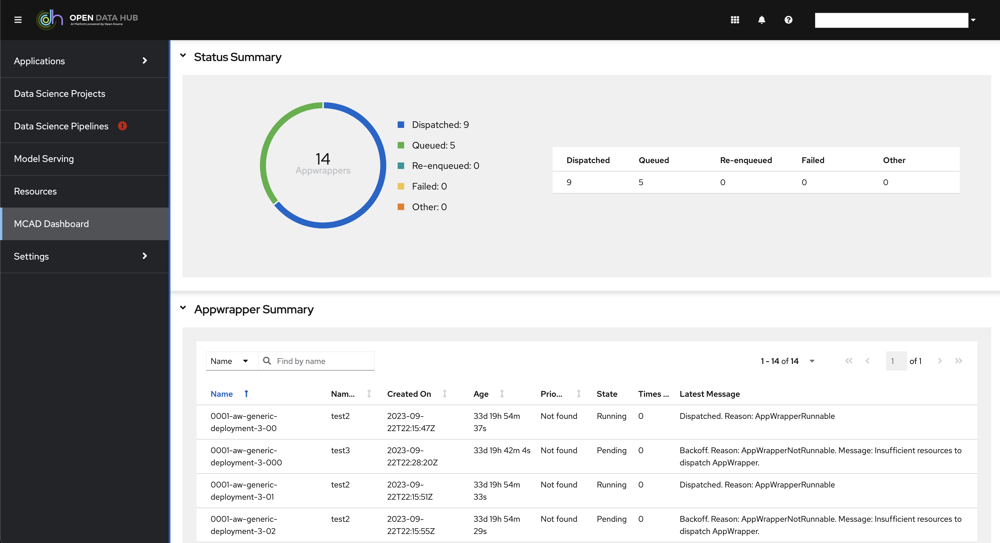

# Multi-Cluster App Dispatcher Dashboard

A dashboard for Multi-Cluster App Dispatcher and Open Data Hub components.



For more detailed current features of the MCAD dashboard:
 
- [MCAD Dashboard Features](/FEATURES.md)


ODH Dashboard Installation and Components:
- Shows what's installed
- Show's what's available for installation
- Links to component UIs
- Links to component documentation

## Requirements

ODH requires the following to run:

- [NodeJS and NPM](https://nodejs.org/)
  - Node recommended version -> `18.16.0`
  - NPM recommended version -> `9.6.7`
- [OpenShift CLI](https://docs.openshift.com/container-platform/4.12/cli_reference/openshift_cli/getting-started-cli.html)
- [kustomize](https://github.com/kubernetes-sigs/kustomize)
- [podman](https://github.com/containers/podman)
- Have access to [Quay.io](https://quay.io/)

### Additional tooling requirements

- [OpenShift CLI, the "oc" command](https://docs.openshift.com/container-platform/4.12/cli_reference/openshift_cli/getting-started-cli.html)
- [Podman](https://github.com/containers/podman)
- [Quay.io](https://quay.io/)

## Development

   1. Clone the repository

      ``` bash
      git clone https://github.com/opendatahub-io/odh-dashboard
      ```

   2. Within the repo context, install project dependencies

      ```bash
      cd odh-dashboard && npm install
      ```

### Build project

  ```bash
  npm run build
  ```

### Serve development content

This is the default context for running a local UI.  Make sure you build the project using the instructions above prior to running the command below.

  ```bash
  npm run start
  ```

For in-depth local run guidance review the [contribution guidelines](./CONTRIBUTING.md#Serving%20Content).

### Testing

Run the tests.

  ```bash
  npm run test
  ```

Run storybook a11y tests and interaction tests.

  ```bash
  npm run storybook
  npm run test:storybook
  ```

For in-depth testing guidance review the [contribution guidelines](./CONTRIBUTING.md#Testing)

## Deploying the ODH Dashbard

### Official Image Builds

odh-dashboard images are automatically built and pushed to [quay.io](https://quay.io/repository/opendatahub/odh-dashboard) after every commit to the `main` branch. The image tag name format for each image is `main-<COMMIT SHORT HASH>`.

Example: The `main` branch is updated with commit `f76e3952834f453b1d085e8627f9c17297c2f64c`.  The CI system will automatically build an odh-dashboard image based on that code and push the new image to `odh-dashboard:main-f76e395` and updated `odh-dashboard:main` to point to the same image hash.

The [nightly](https://quay.io/opendatahub/odh-dashboard:nightly) tag is a floating tag that is updated nightly and points to the most recent `main-<HASH>` commit from the previous day.

### Deploy using kustomize

The [manifests](./manifests) folder contains a [kustomize](https://kustomize.io) manifest that can be used with `kustomize build`.

### Deploy using a kfdef

The [manifests/kfdef](./manifests/kfdef) folder contains an example kfdef to deploy ODH Dashboard with the Notebook Controller backend is located in [odh-dashboard-kfnbc-test.yaml](manifests/kfdef/odh-dashboard-kfnbc-test.yaml).

## Contributing

Contributing encompasses [repository specific requirements](./CONTRIBUTING.md).

### Triaging

For information on how we triage tickets, see our [triage.md](./docs/triaging.md).

## Documentation

You can find more information about this project in the [document section](./docs/README.md).

## Releases

For more information on how, when, and what we do for releases, see our [releases.md](./docs/releases.md).
